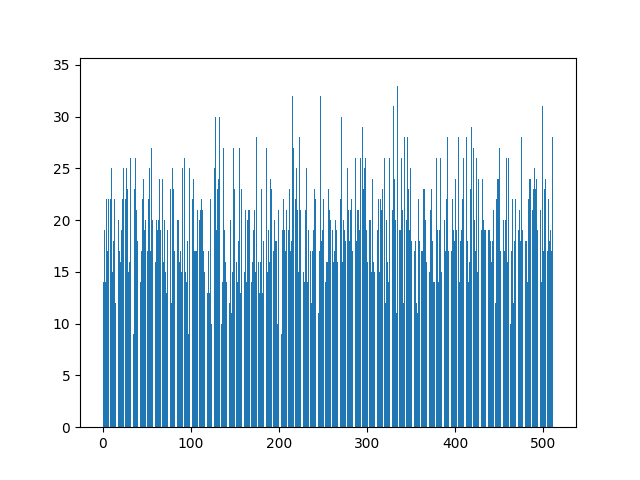
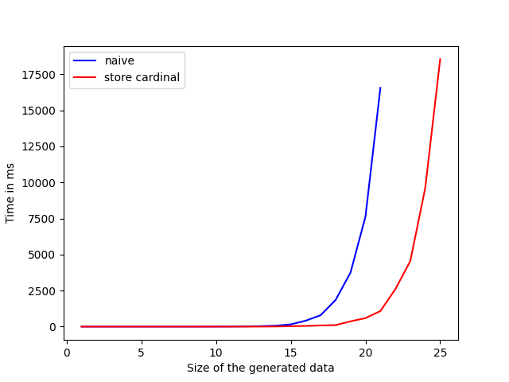

# Space exploration

- *Generating constrained random data with uniform distribution*, Koen Claessen, Jonas Duregard, Michal H. Palka (2015) DOI: 10.1007/978-3-319-07151-0_2

## The generator is uniform

In order to experimentally verify that our implementation does not
lose the uniformity of the distribution, we generate 10_000 list of
9 booleans, read them as binay number (between 0 and 511) and count
the occurences of the different numbers.

	

## The generator is exponential w.r.t the size of the data

In order to measure the performance of the genrator in time,
we measure the time taken to generate 10 list of natural number
with a size in number of constructor ranging over $[1..20]$ with
the naive approach and a small optimisation consisting of storing
the cardinal of the sets rather than recomputing it.

	

