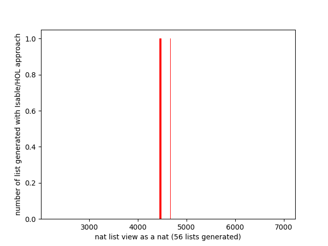

# Provisional conclusions about the experiments :construction_worker:

So far, I've found two different approaches:

1. translating inductive predicate into generators
2. enumerating a data type, pruning the parts of the space that does
   not respect the preconditions


## Translating inductive predicate into generators

In Isabelle/HOL:

- *Executiong Higher Order Logic*, Stefan Berghofer and Tobias Nikpow
  (2000) DOI: 10.1007/3-540-45842-5_2
- *Random testing in Isabelle/HOL*, Stefan Berghofer and Tobias Nikpow
  (2004) DOI: 10.5555/1030033.1030056

In Coq:

- *Generating Good Generators for Inductive Relations*, Leonidas
  Lampopoulos, Zoe Paraskevopoulou, Benjamin C. Pierce (2018) DOI:
  10.1145/3158133

This approach is developped in the context of property based testing
in proof assistant. The idea is two eliminate by testing the the loss
of time that is trying to prove something wrong.

In the context of Iabelle/HOL, indutive predicates are expressed in
higher order logic. While in the context of Coq, they are expressed as
dependant types (basically an inductive relation which arguments are
simple inductive types). Both are parts of the language uses by
the corresponding proof assistant.

One of the task would then be to determine a way for the user to
define such predicates and preconditions in OCaml, define a logical
language in OCaml that is easy to write and expressive enough to be
translated in generators.

Both translations seem straightforward and mechanical. Their is a
mode analysis that determine which arguments of the relation/predicate
are considered as input and which are output. And then some pattern
matching on the input to determine the output.

The mode analysis is something to keep in mind when designing the
logical language for the preconditions.

The authors of both aproaches provide some hand written translation in
their paper. We've implemented them in OCaml in
`src/Transformation.ml`. I have three remarks:

1. The translation, mainly because it is using a mode analysis,
   concerns relations, not just predicates. For example, the predicate
   `SortedList : a list -> Prop` can't mechanically be translated
   using one or the other translation process. We can try to express
   the same predicate as a relation between an optional head and the
   rest of the list, but this is not very natural. The 2018 paper,
   talking about trees, make it clear that the simplest solution is to
   make generators take a size argument. The predicate can then be
   easily expressed as a relation between the size of the list and the
   list itself. There is a bit og information redundancy, but that
   does not add too much complexity for the user.
2. In Isabell/HOL, they translate high order predicate into generators
   of `Seq.t`. The idea is that the lazyness of `Seq.t` allows to
   handle infinite data type, even constrained by preconditions. But
   random exploration of the generated data need to traverse the
   `Seq.t`.
3. In Coq, in the example about binary search trees, they use a
   backtracking combinator for genertors. I've implemented one for
   QCheck, but the version using exception does not work: the
   exception seems to not be caught (??). So I used one with
   generators of optional data (return `None` when failling), which is
   less natural for the user than using the QCheck `assume` or
   equivalent for other property based framework.


For now, my implementation of the Isabell/HOL approach is far from
having a uniform distribution. Taking the 10000 first element of the
generated `Seq.t` of sorted list, viewing a list of natural number
below 10 as a natural number (in decimal notation) to count the occurences,
I obtain this distribution:

:warning: generator and benchmarking may be wrong :warning:

<div align="center">
	
</div>


The Coq approach, while having the same foundatiounal idea (if I
understand correctly), has the advantage of translating/compiling an
inductive predicate/relation into a random generator. No `Seq.t` to
traverse. For now, I still have a problem of distribution with
the `bst` generator: it only generates `Leaf`s.


## Space exploration

- *Generating constrained random data with uniform distribution*, Koen
  Claessen, Jonas Duregard, Michal H. Palka (2015) DOI:
  10.1007/978-3-319-07151-0_2

The basic idea is to build on `Feat`, a library to enumerate data type
up to a given size, to add the possibility to constrain the data type
with a precondition. `Feat` being a functional enumeration, it is not
very easy to deal with such precondition. So the authors of this paper
take another approach to enumeration: they build a lazy (they use
Haskell) space of the data type. This space being an algebraic data
type with a tree like structure, it is then possible to prune parts of
this space when we are sure that all the value below this point won't
respect the precondition.

In the paper, they use some sort of magical function: `universal : ('a
-> bool) -> 'a -> bool option` that I don't see how it can possibly be
implemented.

Instead, I've decided to explore the idea of having predicates on
partial values.

A partial value is either `Bottom` (we don't know what's coming), a
total value ar the application of a construtor to partial values.

A predicate on a partial value is not a function but a data. I've taken
the code-as-data perspective so that I can control the execution of the
predicate. It is either `Universally` true or false when we already know
the answer. For example when we have applied it to a total value, or if
the already defined part of the value make it clear that the precondition
won't be respected. Or it is `Indeterminate` (constructor that takes a function
from partial value to a predicate).

A sorted predicate on partial lists of integer with the partial value:

- the total list `[1;2;3]`, will be `Universally true`
- the partial list `[2;1;⊥]`, will be `Universally false`
- the partial list `[1;2;⊥]`, will be `Indeterminate p`, `p` being the
  function given at the definition of the predicate

One problem is that predicates on partial values are more complex to
write. For example, the predicate for sorted list (and it is after a
certain number of other versions):

```OCaml
  let rec sorted' = function
    | [] | [ _ ] -> true
    | x :: y :: ys -> x <= y && sorted' (y :: ys)

  let sorted : (int, int list) predicate =
    let rec p = function
      | Pure xs -> Universally (sorted' xs)
      | App2 (_, Pure m, App2 (f, Pure n, ns)) ->
          if m > n then Universally false else p (App2 (f, Pure n, ns))
      | _ -> Indeterminate p
    in
    Indeterminate p
```

The other main problem is that space generation is very costly
(exponential w.r.t the size of the data).

To continue in this direction, we should find a way to apply the partial
predicate on a data space.

## The generator is uniform

In order to experimentally verify that our implementation does not
lose the uniformity of the distribution, we generate 10_000 list of
9 booleans, read them as binay number (between 0 and 511) and count
the occurences of the different numbers.

<div align="center">
	
</div>


## Time complexity w.r.t size

In order to measure the performance of the genrator in time, we
measure the time taken to generate 10 list of natural number with a
size in number of constructor ranging over $[1..20]$ with the naive
approach and an optimisation consisting of storing the cardinal of the
sets rather than recomputing it.

<div align="center">
	
</div>
